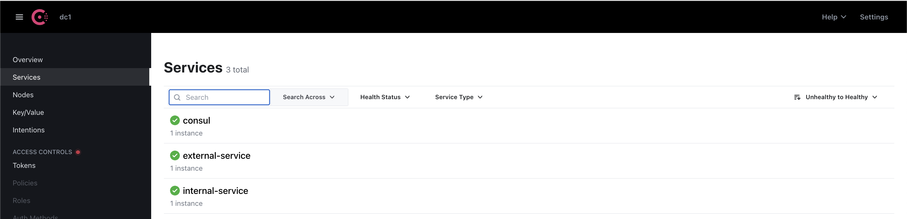

# Sercan Cidem - Oodle Finance
Coding Task for Oodle Finance

### API endpoints:
> Add a new message
* **POST**: http://localhost:8081/api/v1/message/
> JSON Body:
```javascript
{"message": "New Message"}
```
> Get all messages:
* **GET**: http://localhost:8081/api/v1/message/all

> Get a message by id:
* **GET**: http://localhost:8081/api/v1/message/555

> Delete a message by id:
* **DELETE**: http://localhost:8081/api/message/123

> Consul (Hashicorp)
* Run this command `consul agent -dev` to start consul
* Run both internal-service and external-service applications
* Open http://localhost:8500/ui and you should see a screen like



> Postman Export File
* You can import Postman requests of these endpoints. `OodleFinance Collection.postman_collection.json`